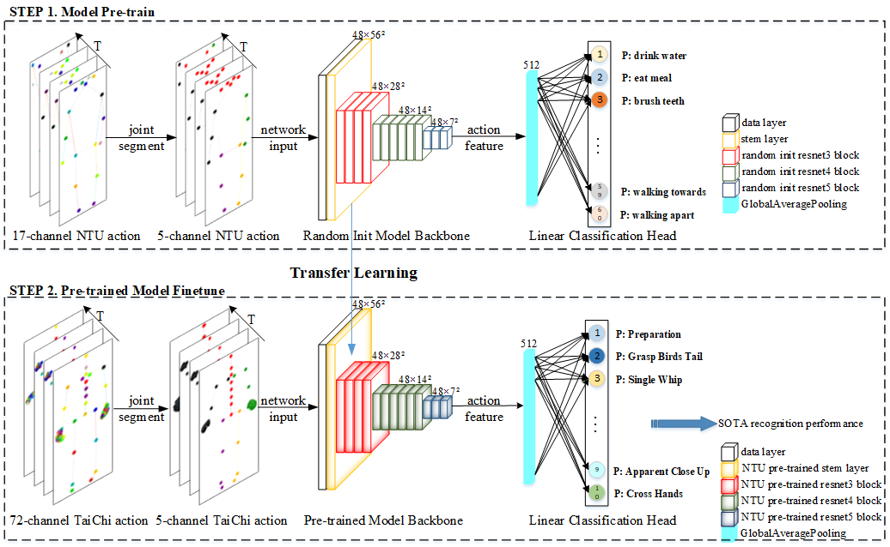

# SSCLS

SSCLS is the official implementataion of our **S**mall-**S**cale human action **CL**a**S**sification model pipeline. We build this project base on Open Source Projection [MMAction2](https://github.com/open-mmlab/mmaction2) and [PYSKL](https://github.com/kennymckormick/pyskl)

<div id="wrapper" align="center">
<figure>
  <br>
  <p style="font-size:2.0vw;">SSCLS model pipeline</p>
</figure>
</div>


## Supported Skeleton Datasets

- [x] [Nursing Activities](https://ieee-dataport.org/competitions/nurse-care-activity-recognition-challenge)
- [x] [Tai Chi Data](https://hit605.org/projects/taichi-data/)


## Installation
```shell
git clone https://github.com/eunseo-v/sscls
conda create -n sscls python=3.8
conda install pytorch==1.10.1 torchvision==0.11.2 torchaudio==0.10.1 cudatoolkit=11.3 -c pytorch -c conda-forge
conda activate sscls
pip install openmim
mim install mmcv-full==1.5.0
mim install mmdet
mim install mmpose
cd sscls
pip install -r requirements.txt
pip install -e .
```


## Data Preparation
We provide segmented Nursing Activity and Tai Chi action datasets and the heatmap conversion program to transform the 3D skeleton coordinates to 2D heatmaps. To obtain the human skeleton annotations, you can:

#### Nursing Activities

1. Download raw csv files from website https://ieee-dataport.org/competitions/nurse-care-activity-recognition-challenge.
2. Generate npy files by ```python project_utils/ncrc_npy.py ```.
3. Generate heatmap files by ```python project_utils/gen_ncrc_set.py```.

#### Tai Chi Dataset

1. Download segmented dataset from [Google Drive](https://drive.google.com/file/d/1w4trelnmqZe5F0D_aCpia-FqJ3kDMHWD/view?usp=sharing) 
2. Generate heatmap files by ```bash order/gen_tc.sh```

You can use [vis_skeleton](/demo/vis_skeleton.ipynb) to visualize the provided skeleton data.

## Training & Testing

#### Training  
We have conducted a series of experiments including: 
* Pre-training models ```bash order/ntu120.sh```
* Lr grid search in LP ```bash order/exp0.sh```
* Impact of data preprocessing in LP ```bash order/exp1.sh```
* Effectiveness of joint segment strategy ```bash order/exp2.sh```
* Effectiveness of pre-training strategy ```bash order/exp3.sh```
* Multimodality and Late fusion ```bash order/exp4.sh```
* Lr grid search and pre-training comparison in FT ```bash order/exp5.sh```
* Stable Results with different data preprocessing methods ```bash order/exp6.sh```
* Results on Nursign Activities ```bash order/exp7.sh```
* Results on Tai Chi ```bash order/exp8.sh```

#### Testing 

```bash order/test.sh```

## Contact

For any questions, feel free to contact: _eunseo_v@hit.edu.cn
